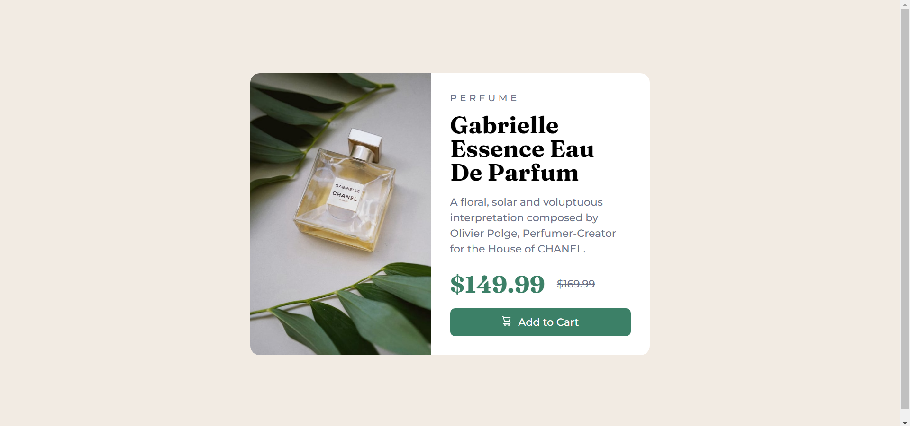

# Product preview card component solution

This is a solution to the [Product preview card component challenge on Frontend Mentor](https://www.frontendmentor.io/challenges/product-preview-card-component-GO7UmttRfa).

## Table of contents

- [Overview](#overview)
  - [The challenge](#the-challenge)
  - [Screenshot](#screenshot)
  - [Links](#links)
- [My process](#my-process)
  - [Built with](#built-with)
  - [Continued development](#continued-development)
- [Author](#author)

**Note: Delete this note and update the table of contents based on what sections you keep.**

## Overview

### The challenge

Users should be able to:

- View the optimal layout depending on their device's screen size
- See hover and focus states for interactive elements

### Screenshot

Mobile Design

Tablet Design

### Links

- Solution URL: [Front End Mentor Solution Page](https://www.frontendmentor.io/solutions/product-preview-card-component-CS883Jkzuq)
- Live Site URL: [Live site URL](https://product-preview-card-component07.netlify.app/)

## My process

### Built with

- Semantic HTML5 markup
- CSS
- SASS
- Flexbox
- Mobile-first workflow

### Continued development

Not happy with the font size in tablet design, will update later.

## Author

- Frontend Mentor - [@Manan-Bhatia](https://www.frontendmentor.io/profile/Manan-Bhatia)
- Twitter - [@MananBhatia02](https://twitter.com/MananBhatia02)

